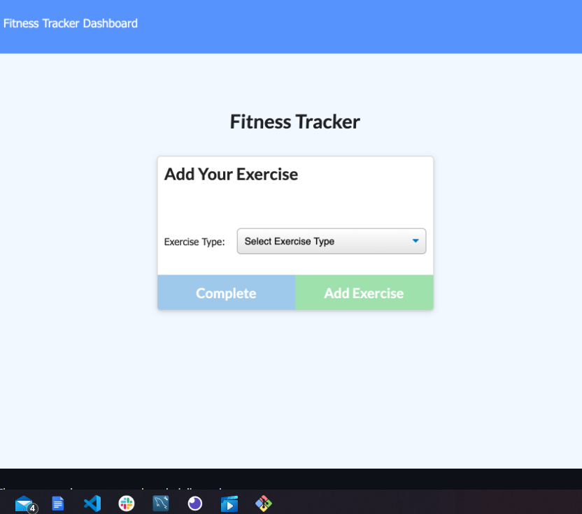
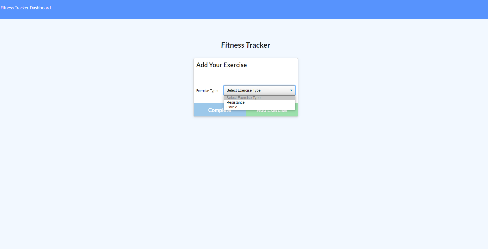
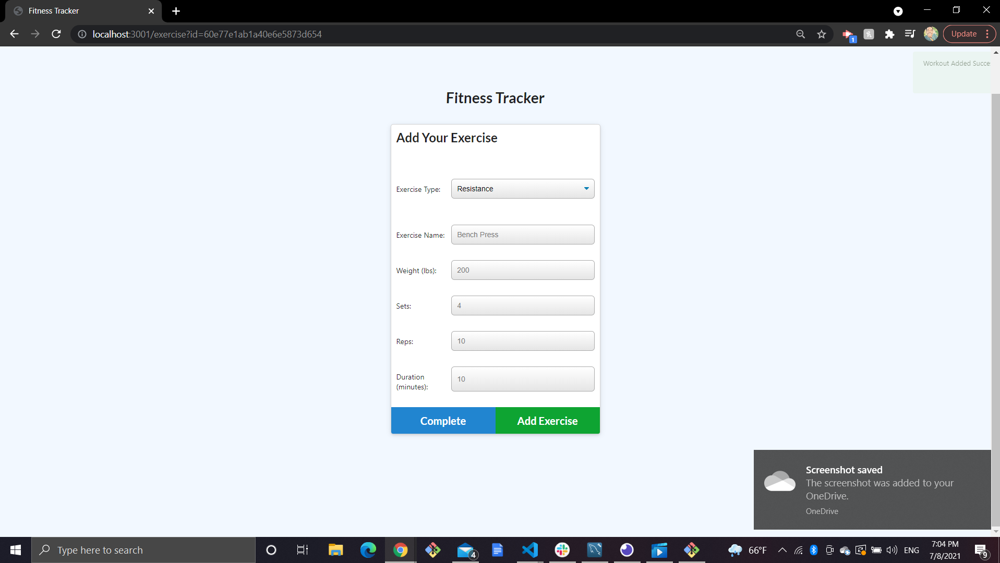
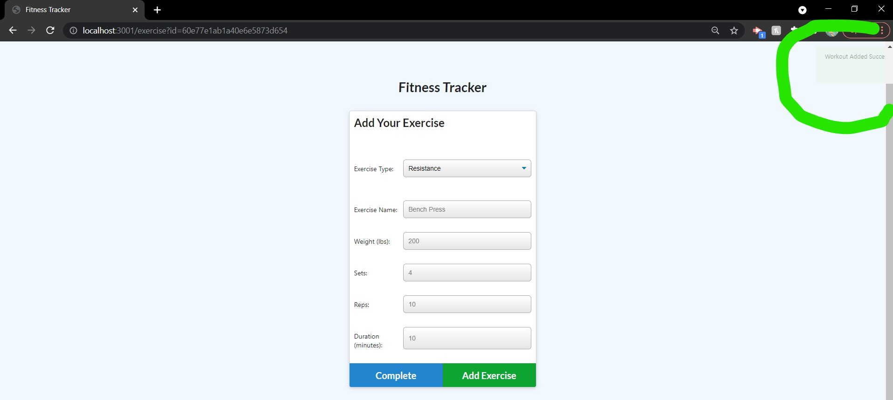
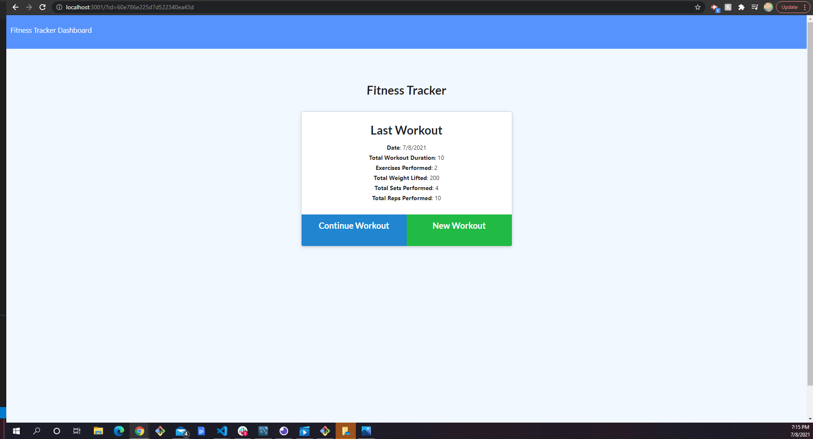

# FitTrackr17
A consumer will reach their fitness goals more quickly when they track their workout progress

## Descrpition 

## Tech-Used
 * HTML 
 * CSS
 * JavaScript
 * Node
 * Express
 * MongoDB
 * Dependencies
   - express
   - mongoose
   - morgan

## Local-Installation
 1. Clone the repository onto you local machine []
 2. Run the "npm install" command in your terminal/gitbash
 3. Run the command "npm run seed" in your terminal/gitbash
 4. Run the command "npm start" to start the server

## Usage 

1. When the pages loads the user is presented with a container that provides a drop down menu to select a type of exercise

2. Once the user makes a selection, the page switches to a form that allows the user to enter the data of their workout.
After the user enters all the data and selects 'Add Exercise' the workout is automatically saved in the NOSQL database

3. In order the view the workout info, the user would select 'Complete' and be automatically lead to a log of the last workout 

## Deployed Links 
[Heroku Link](https://afternoon-thicket-12508.herokuapp.com/)
[GitHub Repository](https://github.com/KENSTONEJAY/FitTrackr17)

## Contacts
[Ken Otuo](https://github.com/KENSTONEJAY)
